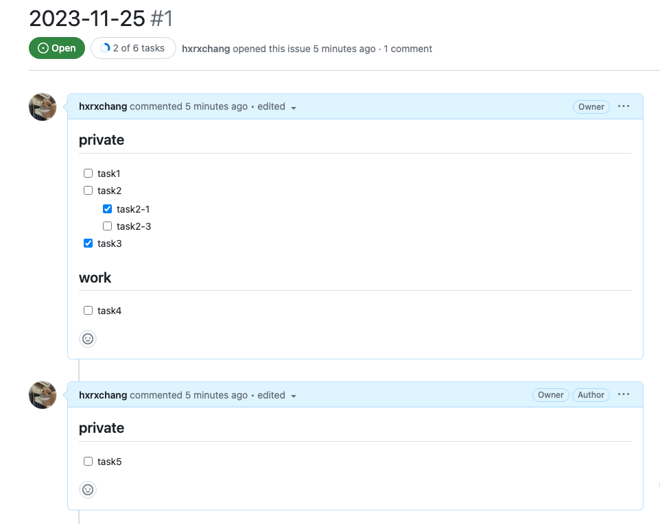
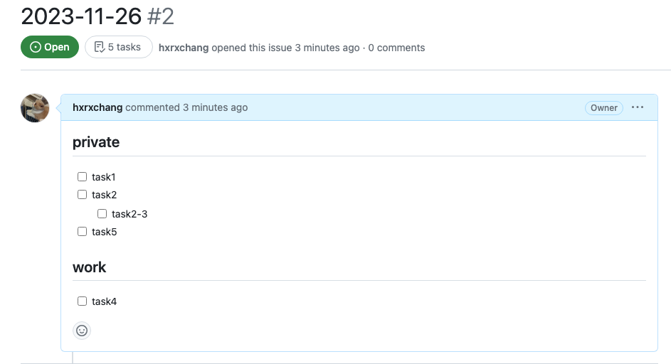

# gtd-manager

## 概要

gtd-manager は GitHub の Issue でタスク管理を簡単に行えるようにする CLI ツールです。  
gtd は [Getting Things Done](https://asana.com/ja/resources/getting-things-done-gtd) の略です。

gtd-manager を実行すると、Repository の最新の Issue を取得して、その Issue の Body とコメントから未完了のタスクだけを抜き出して、新たな Issue を作成します。  
同じ見出しの直下にあるタスクは、別コメントに記述されていてもまとめられます。

| 最新の issue                                | 作成された issue                               |
| ------------------------------------------- | ---------------------------------------------- |
|  |  |

GitHub Actions で 1 日に 1 回実行することで、日々のタスク管理に役立てることができます。

## 利用方法

タスク管理を行いたいリポジトリで以下のように GitHub Actions の設定をしてください。  
issue が 0 件の場合エラーになるので、予め作成してください。

`.github/workflows/main.yml`

```yml:
on:
  schedule:
    - cron: "0 18 * * *" # JST 03:00

jobs:
  create_issue:
    runs-on: ubuntu-latest
    steps:
      - uses: hxrxchang/gtd-manager@v0.0.10
        with:
          GITHUB_TOKEN: ${{ secrets.GITHUB_TOKEN }}
          GITHUB_REPOSITORY: $GITHUB_REPOSITORY
          TIME_ZONE: "Asia/Tokyo" #オプショナル。デフォルトはUTC
```

`secrets.GITHUB_TOKEN` が書き込み権限を持てるように、リポジトリの Settings -> Actions -> General を開いて、 Workflow permissions で `Read and write permissions` を選択してください。
